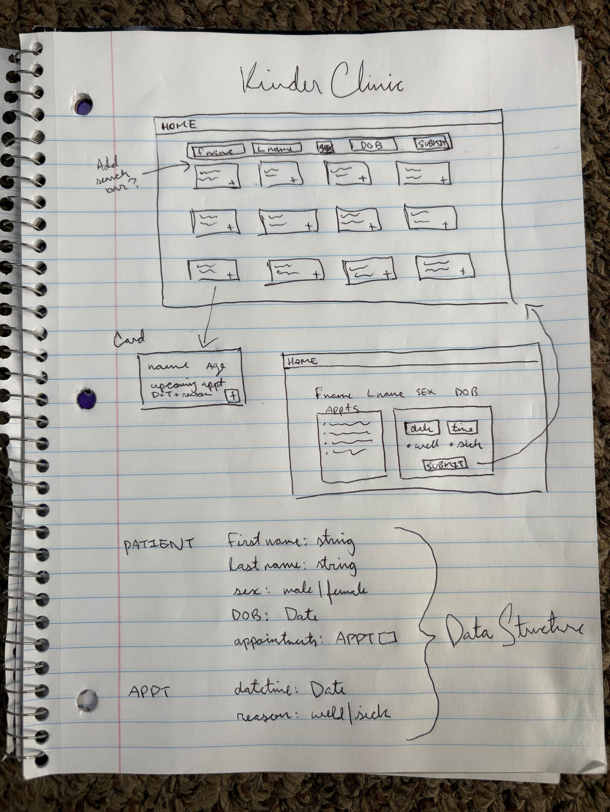

# KinderClinic

A simple patient registration and scheduling app built in React (initialized with Vite).

## Run the project

1. Confirm Node.js and NPM are installed on your computer 
2. Clone the repository
3. Navigate to the project directory
4. Install dependencies (`npm install`)
5. Start the development server (`npm run dev`)

## Acceptance Criteria

1. View a list of their children (the patients).

- Display each child’s name, age, and whether they have an upcoming
  appointment.

2. Submit a form to add a new child to the list.

- It should capture at least these fields: first name, last name, sex, and date of birth.
- After submitting the form, the newly added child should appear in the list.

3. Schedule an appointment for their child.

- The user can click somewhere to schedule an appointment for any of their
  children.
- Assume we have infinite availability, so we simply need the parent to provide a
  date, time, and purpose of their visit (“well visit” or “sick visit”).
- Once scheduled, the appointment info should be shown somewhere.

## Assumptions Made

* No authentication/authorization details are needed for this feature set
* The (unauthenticated) user would have permission to see all patients in the database
* Scalability isn’t in scope - the feature assumes a small list of children, not thousands (ie. no pagination, no search or filtering)
* Age is calculated dynamically from date of birth, not stored directly
* Sex is binary (didn't include "X" or other third designation)
* Infinite availability means no need for conflict checks, provider schedules, or capacity logic.
* Past appointments are hidden/not needed for this scope (displays upcoming appointments only)
* The “purpose” values are limited to 'well' and 'sick' — no custom text.
* Time zones, duration, and providers aren’t relevant since scheduling is simplified.

## What I would do with more time

* Data Validation & Error Handling
  - Validate input (e.g., DOB not in the future, appointment not in past, required fields can’t be blank).
  - Provide clear error messages and inline form validation.
* Better Appointment Handling
  - Support multiple upcoming appointments per child, not just a flag.
  - Display appointment history (past visits).
  - Add editing or cancelling appointments
* Full CRUD feature set for patients and appointments
  - Add ability to delete patients, edit properties beyond just appointments
* Improved User Experience
  - Enhance the UI with clearer visual cues for upcoming appointments.
  - Add success/error toasts for actions.
  - Include search or filters in the patient list (e.g., by name or age).
  - Add icons or avatars for children to make the list more engaging.
  - Set up analytics to track how often appointments are scheduled.
* Data Persistence & Sync
  - Persist data to a backend or local storage so it survives page refresh.
  - Sync updates in real time if multiple users are managing children.
* Robustness & Testing
  - Add unit and integration tests, especially for adding children and scheduling appointments
* Scalability & Flexibility
  - Add authentication and multiple user types (providers, parent/guardian) with linked users
  - Create a real API and database that could handle scaled patient data (ie thousands of patients)
  - Add pagination to backend request/response and to UI list

## Features I'm proud of

* Loading state ([skeleton screen](https://www.nngroup.com/articles/skeleton-screens/) for improved UX)
* Accessibility
  - TextInput component has a flyaway label that approximates placeholder text but is semantically a label
  - Modal component traps keyboard focus and handles escape key
  - Forms and lists are fully keyboard navigable & screen reader tested (spec. on VoiceOver)
  - Colors meet color contrast minimums
* UI styling (subtlety to card borders/shadows, button press, skeleton shimmer animation, flyaway labels, etc...)
* Mocked out API with axios listens for endpoints & returns Promises/data as an API would
* Mobile responsive (also good for WCAG 1.4.4)
* Deployed live to Github Pages

## Screenshot

## Lofi Wireframes

